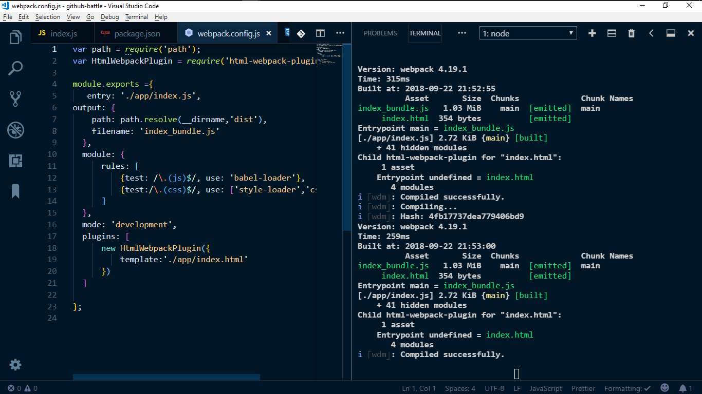

"# webpack_config" 

__USE YARN INSTALL TO INSTAL ALL DEPENDENCIES__

__USE YARN RUN START TO START A DEV SERVER__

### SORRY, I USE YARN, TRY USING NPM IN PLACE OF YARN ###
__FOR DEPENDENCIES LIKE REACT AND REACT DOM USE yarn add react react-dom__
__For other dependencies use yarn add dependenncy --dev to add them to the devDev object instead of the dependency object,if you can use npm to do same, why not!!__
